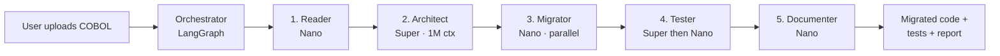

# CodeMigrator AI · Architecture

## TL;DR

A **5-agent LangGraph pipeline** that migrates legacy code (starting with COBOL → Python).
Every agent runs on **NVIDIA Nemotron 3** via the NIM API. Heavy reasoning lives on
**Nemotron 3 Super (120B, 1M ctx)**; high-throughput conversion lives on **Nemotron 3 Nano (30B)**.

## High-level flow

## Why this split?

| Concern                                | Tier            | Why                                                                                                |
| -------------------------------------- | --------------- | -------------------------------------------------------------------------------------------------- |
| Parsing & semantic enrichment          | **Nano**        | Bounded context, mostly mechanical. Deterministic skeleton extraction first, Nano adds semantics.  |
| Architecture design                    | **Super**       | Needs to reason over the *entire* codebase at once — the 1M context window is the unfair advantage.|
| File-by-file conversion                | **Nano** ×N     | High-throughput, parallelizable, cheap. Each file is small relative to the full plan.              |
| Test strategy → cases                  | **Super → Nano**| Strategy is reasoning-heavy; case generation is mechanical.                                        |
| Markdown report                        | **Nano**        | Synthesis of structured inputs into prose. No deep reasoning required.                             |

This split is the textbook **Nemotron Super + Nano routing pattern**: send the rare
hard-thinking task to Super, keep the bulk of the work on Nano.

## Routing distribution (deterministic from architecture)

For a 3-file COBOL banking demo we make exactly:

- 1 Reader (Nano) + 1 Architect (Super) + 3 Migrator (Nano)
  + 2 Tester (1 Super, 1 Nano) + 1 Documenter (Nano)
- = **6 Nano / 8 total = 75% routed to Nano**.

That's the headline metric the UI surfaces — *"Routed to Nano: 75%"*. With more files
the Migrator's parallel Nano calls push the percentage higher.

NVIDIA hasn't published per-token pricing for these specific NIM-hosted models, so we
don't claim a dollar figure. See [BENCHMARKS.md](BENCHMARKS.md) for the live token /
latency numbers once captured.

## Components

### `apps/api/llm/nemotron.py`

The single chokepoint for all LLM calls. Wraps `AsyncOpenAI` against the NIM endpoint
(`https://integrate.api.nvidia.com/v1`). Features:

- Tier abstraction: `tier="super" | "nano"`.
- Structured Pydantic output via inline JSON-schema injection.
- Tenacity retry with exponential backoff on transient failures.
- A 15-call semaphore to stay under the 40 req/min free-tier limit.
- Live telemetry: tokens, calls per tier, average latency, est. cost.

### `apps/api/agents/`

One file per agent. Each follows the same shape: a system prompt constant in
`llm/prompts.py`, a thin `run()` async function, and a Pydantic output model in
`models/outputs.py`.

### `apps/api/agents/orchestrator.py`

LangGraph `StateGraph` with linear edges:
`reader → architect → migrator → tester → documenter → END`. Every node updates a
`MigrationState` TypedDict so the SSE layer can stream incremental progress.

### `apps/api/routes/migrate.py`

`POST /api/migrate` accepts a multipart upload (or zip), runs the graph via
`graph.astream(...)`, and pushes one SSE event per state change. Event types:
`progress`, `agent_thinking`, `agent_complete`, `metrics`, `complete`, `error`.

### `apps/web/`

Next.js 14 App Router frontend. Single page (`app/page.tsx`) wires up:

- `<FileUpload>` — drag/drop or "Try Sample"
- `<AgentTimeline>` — vertical 5-step progress with Super/Nano tier badges
- `<CodeDiff>` — Monaco diff editor (before/after per file)
- `<MetricsCard>` — live tokens / cost / Nano routing percent
- `<ReportPanel>` — final markdown report from the Documenter

Streaming is handled by `lib/sse.ts`, which pumps a `fetch()` ReadableStream
through a TextDecoder and parses each `data:` line as JSON. We use POST for
the upload, so plain `EventSource` isn't an option.

## Failure modes & mitigations

| Failure                                | Mitigation                                                                  |
| -------------------------------------- | --------------------------------------------------------------------------- |
| Rate limit (40 req/min)                | Asyncio semaphore + tenacity exponential backoff                            |
| Malformed JSON from Nemotron           | Strip markdown fences, find first `{`/`[`, then validate                    |
| Single-file migration fails            | `asyncio.gather(return_exceptions=True)` so one bad file doesn't kill batch |
| Long-running Architect call            | SSE keeps connection warm; UI shows "thinking" indicator                    |
